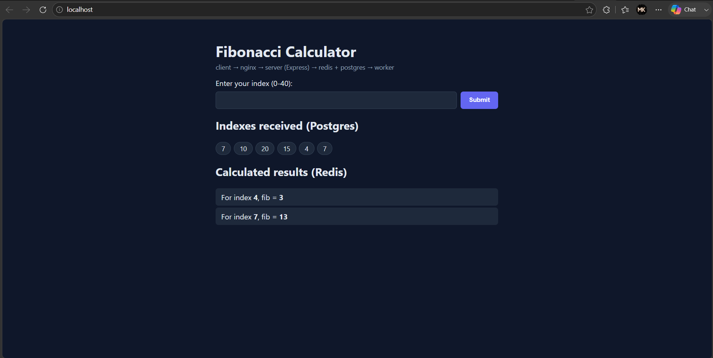
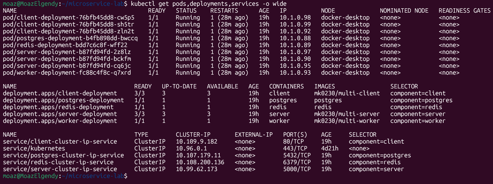
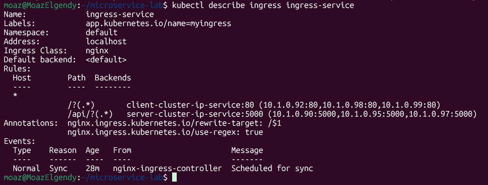
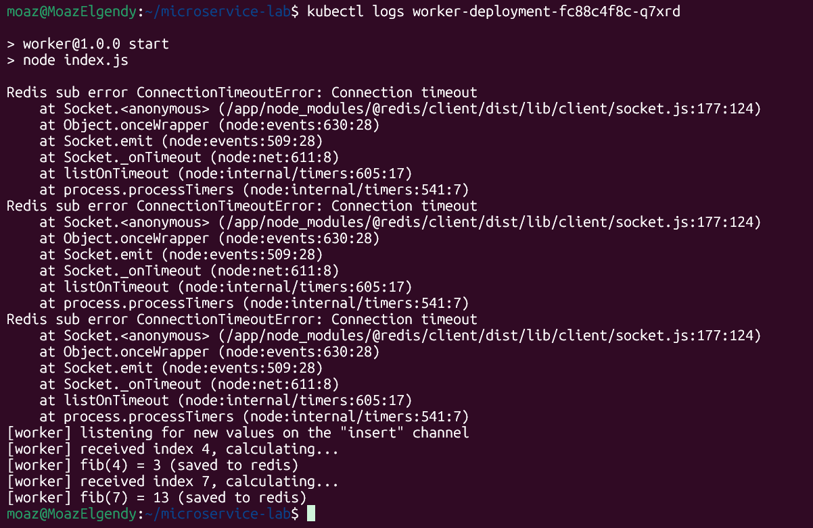
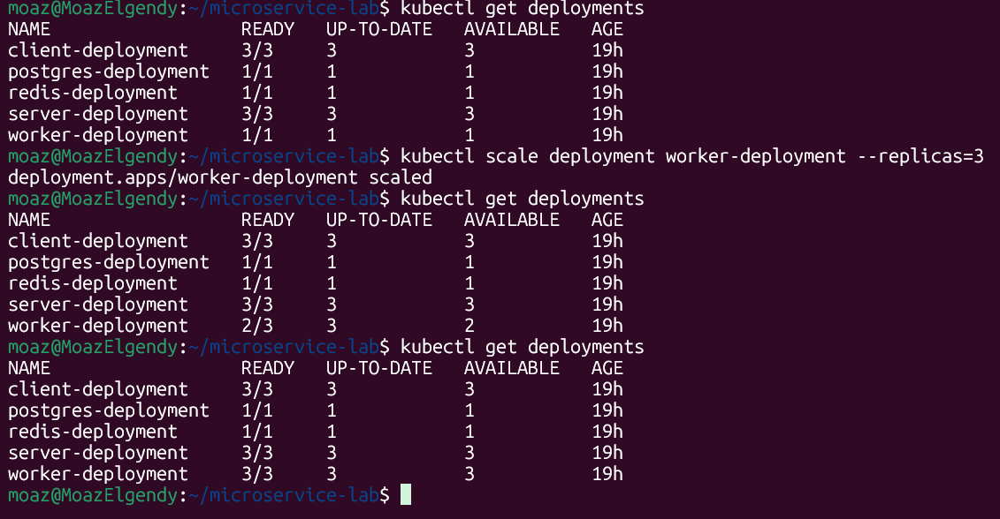
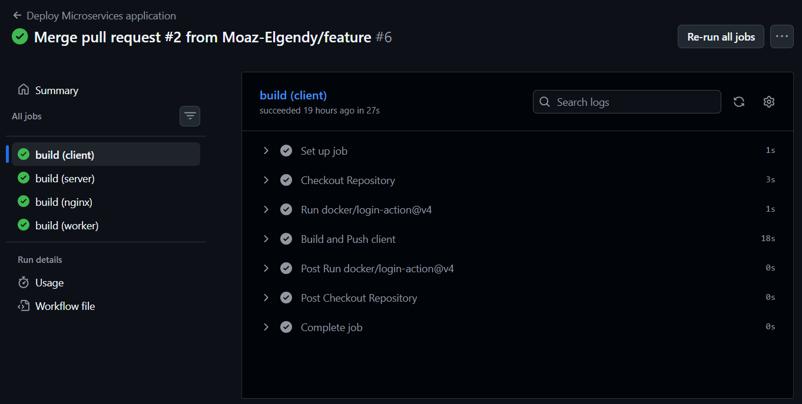

# Microservices Lab — Fibonacci Calculator on Kubernetes

A hands-on lab for learning Kubernetes by deploying a small multi-service
application: a React client, an Express API, a Node.js worker, Postgres, and
Redis — all wired together with Kubernetes Deployments, Services, an
Ingress, and a PersistentVolumeClaim, with images built and pushed
automatically via GitHub Actions.

## What it does

You submit a number (0–40) in the browser. The API stores it in Postgres and
publishes it to Redis. A separate worker picks it up, calculates the
Fibonacci value, and writes the result back to Redis. The client polls both
data sources and shows:

- every index it has ever received (from **Postgres**)
- the calculated result for each index (from **Redis**)

## Architecture

```
                        ┌─────────────────────────┐
                        │   Ingress (nginx-ingress) │
                        └────────────┬─────────────┘
                     /                              /api/*
                     │                                  │
                     ▼                                  ▼
        ┌─────────────────────────┐      ┌─────────────────────────┐
        │  client (nginx + React) │      │   server (Express API)  │
        │  Deployment, 3 replicas │      │  Deployment, 3 replicas │
        └─────────────────────────┘      └────────────┬────────────┘
                                                        │
                                        ┌───────────────┴───────────────┐
                                        ▼                               ▼
                          ┌──────────────────────┐        ┌──────────────────────┐
                          │  postgres (1 replica) │        │   redis (1 replica)  │
                          │  + PersistentVolume   │        │  pub/sub "insert"    │
                          └──────────────────────┘        └───────────┬──────────┘
                                                                       │
                                                                       ▼
                                                          ┌──────────────────────┐
                                                          │   worker (1 replica)  │
                                                          │  computes fibonacci   │
                                                          └──────────────────────┘
```

The **client is not a raw React dev server** — its Docker image is a
multi-stage build: `npm run build` produces static files, and those are
served by nginx inside the client container. The standalone `nginx/` folder
in this repo (with its own Dockerfiles and configs) is only used for local
`docker-compose` testing; inside the actual Kubernetes cluster, routing is
handled by the **ingress-nginx controller** via `ingress-service.yml`, not by
that container.

## Repo structure

```
client/         React app, built + served via nginx (see client/Dockerfile)
server/         Express API — talks to Postgres and Redis
worker/         Node process — subscribes to Redis, computes Fibonacci
nginx/          Reverse proxy config, used only for local docker-compose runs
config_k8s/     All Kubernetes manifests (Deployments, Services, Ingress, PVC)
.github/        CI/CD workflow — builds and pushes images to Docker Hub
docker-compose.dev.yml   Local dev environment (no Kubernetes needed)
```

## Kubernetes resources

| Resource | Kind | Replicas | Notes |
|---|---|---|---|
| `client-deployment` | Deployment | 3 | nginx serving the built React app |
| `client-cluster-ip-service` | Service (ClusterIP) | — | port 80 |
| `server-deployment` | Deployment | 3 | Express API, env-configured for Postgres/Redis |
| `server-cluster-ip-service` | Service (ClusterIP) | — | port 5000 |
| `worker-deployment` | Deployment | 1 | Fibonacci calculator, subscribes to Redis |
| `postgres-deployment` | Deployment | 1 | backed by a PVC, password from a Secret |
| `postgres-cluster-ip-service` | Service (ClusterIP) | — | port 5432 |
| `redis-deployment` | Deployment | 1 | in-memory, no persistence |
| `redis-cluster-ip-service` | Service (ClusterIP) | — | port 6379 |
| `database-persistent-volume-claim` | PVC | — | 2Gi, `ReadWriteOnce` |
| `ingress-service` | Ingress | — | routes `/` → client, `/api/*` → server |

Secrets (`pgpassword`) are created manually and are **not** committed to the
repo — see [Setup](#setup) below.

## CI/CD

`.github/workflows/deploy.yml` builds and pushes fresh images for `client`,
`server`, and `worker` to Docker Hub on every push to `main`. The
`config_k8s/*-deployment.yml` files pull those same image names
(`mk0230/multi-client`, `mk0230/multi-server`, `mk0230/multi-worker`), so
redeploying is just:

```bash
kubectl rollout restart deployment client-deployment server-deployment worker-deployment
```

## Setup (Docker Desktop Kubernetes)

1. Enable Kubernetes in Docker Desktop (Settings → Kubernetes → Enable).
2. Create the Postgres password secret:
   ```bash
   kubectl create secret generic pgpassword --from-literal PGPASSWORD=yourpassword
   ```
3. Install the ingress-nginx controller (Docker Desktop doesn't ship one by default):
   ```bash
   kubectl apply -f https://raw.githubusercontent.com/kubernetes/ingress-nginx/controller-v1.11.1/deploy/static/provider/cloud/deploy.yaml
   ```
4. Apply all manifests:
   ```bash
   kubectl apply -f config_k8s
   ```
5. Visit `http://localhost` in your browser.

## Local development without Kubernetes

```bash
docker-compose -f docker-compose.dev.yml up --build
```

## Screenshots

### 1. The app running


Submitting a number, with the "seen indexes" (Postgres) and "calculated
results" (Redis) lists populated.

### 2. Pods, services, and deployments


`kubectl get pods,deployments,services -o wide` — shows all replicas
running and healthy, with client/server at 3 replicas each and
worker/postgres/redis at 1.

### 3. Ingress routing


`kubectl describe ingress ingress-service` — confirms the `/` and `/api/*`
paths are correctly wired to the `client` and `server` ClusterIP Services.

### 4. Worker logs


`kubectl logs deployment/worker-deployment` — shows the worker receiving an
index over the Redis `insert` channel and publishing back the calculated
Fibonacci value.

### 5. Scaling the worker


Before/after of `kubectl scale deployment worker-deployment --replicas=3`,
showing the extra worker pods coming up. Good visual for demonstrating
horizontal scaling.

### 6. GitHub Actions pipeline


A successful run of `deploy.yml` building and pushing all three images to
Docker Hub.

## What I learned / practiced

- Splitting an app into independently deployable services with their own
  Dockerfiles and lifecycles
- ClusterIP Services for internal-only communication vs. Ingress for the
  single external entrypoint
- Passing configuration via environment variables so the same image works
  across Docker Compose and Kubernetes with different service hostnames
- Using Secrets for credentials instead of hardcoding them in manifests
- PersistentVolumeClaims for stateful services (Postgres) vs. ephemeral
  in-memory ones (Redis)
- Automating image builds and pushes with GitHub Actions